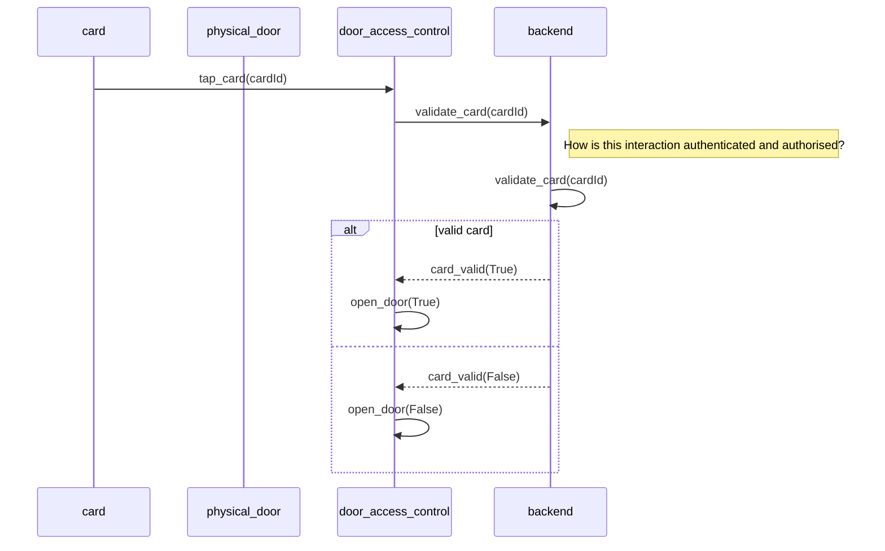

```mermaid
sequenceDiagram
    participant card
    participant physical_door
    participant door_access_control
    participant backend

    card->>door_access_control: tap_card(cardId)
    door_access_control->>backend: validate_card(cardId)
    Note right of backend: How is this interaction authenticated and authorised?
    backend->>backend: validate_card(cardId)

    alt valid card
    backend-->>door_access_control: card_valid(True)
    door_access_control->>door_access_control: open_door(True)
    else
    backend-->>door_access_control: card_valid(False)
    door_access_control->>door_access_control: open_door(False)
    end
```
